----!
Presentation
----!

# Create new project

Create new project **WBA_GPDMA**, similar way as in homework.


  - start at **NUCLEO-WBA52CG** board
  - do not set default state of IP's
  - enable ICACHE
  - enable SWD

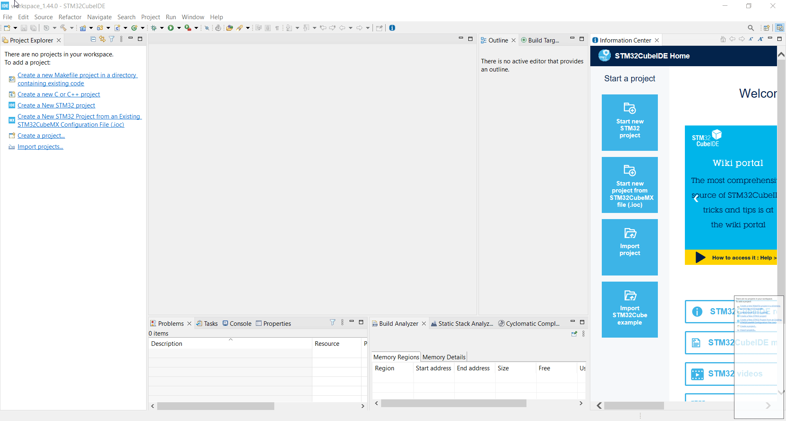

# Select ADC4 peripheral

Select `ADC4 in **Analog**

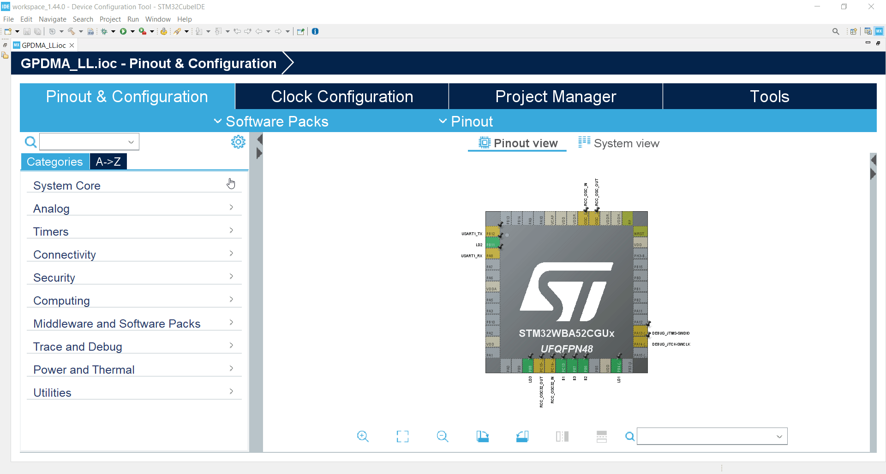

# Enable 4 adc channels
Enable channels IN**2**, IN**3**, IN**4**, IN**6** in Sigle-ended mode

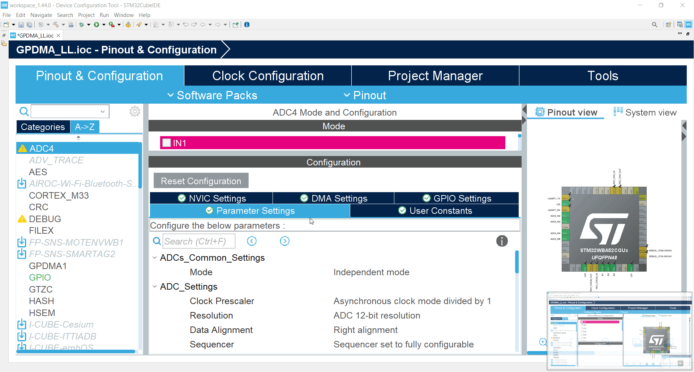

# Configure the ADC 1/3

1. Set `Continuous conversion mode` to **Enable**

This option run ADC in loops. When ADC finish converting all its channels it will start again from beginning.

2. Set `Continuous conversion mode` to **Enable**

This option enable DMA request permanently.

3. Set `Low power wait` to **Enable**

This option will stop ADC until the DATA are read from it. It is good to prevent overrun. And we are sure that we have still correct order of channels.

4. Set `Enable Regular Conversions` to **Enable**


# Configure the ADC 2/3

1. Set `number of conversion` to **4**

This will set ADC to do 4 ADC conversions which we can set.

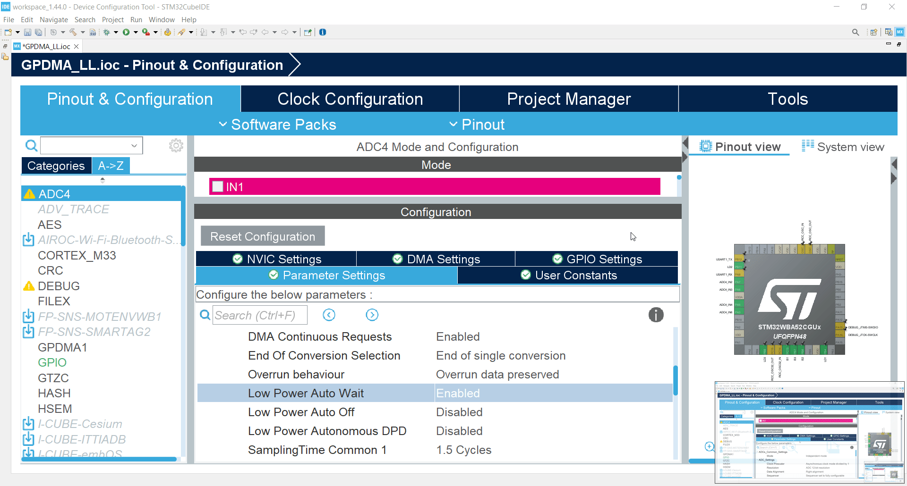
# Configure the ADC 3/3

1. You can set ADC channel for each `Rank`

Each rank will have assigned one ADC channel to convert. It is possible to select same channel each time.

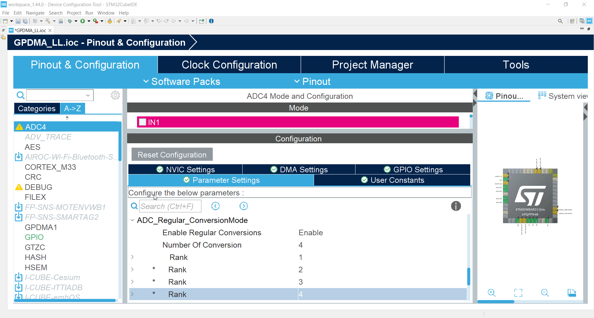

# Change GPDMA mode

1. Select **GPDMA1** in **System** category
2. Set mode of Channel 0 to `Linked-List Mode`

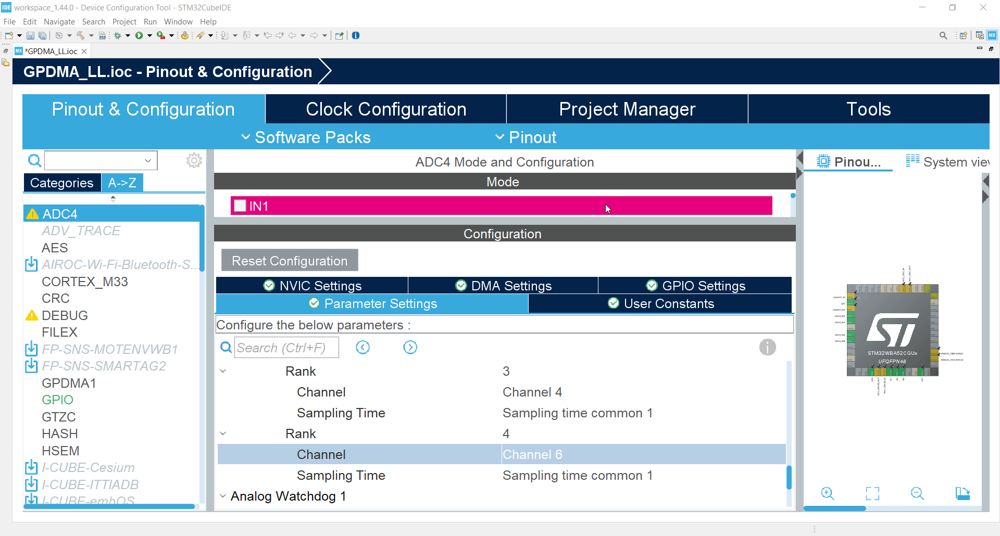

# Configure CH0

1. Go to **CH0** Configuration
2. Set **Execution Mode of Linked List** to `Circular`

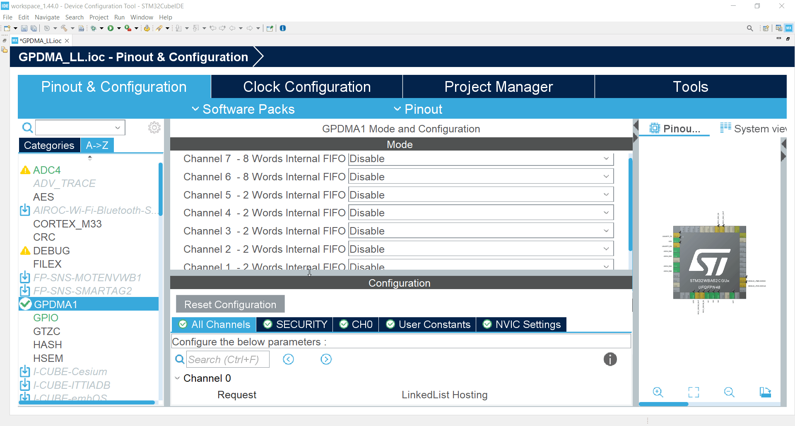

# Linked List configuration 1/2

1. Go to `LINKEDLIST` peripheral in **Utilities**

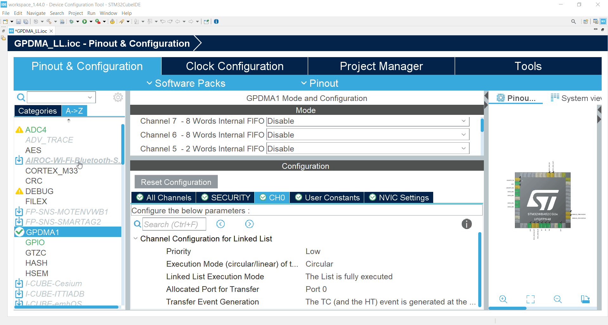

# Linked List configuration 2/2

2. Add List by clicking on `Add List` button

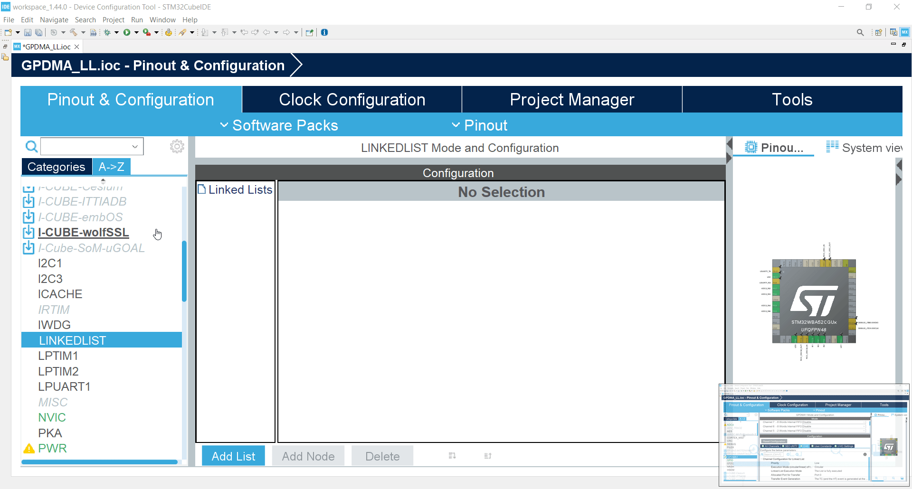

# Configue List/Queue 1/3

1. Click on Queue to be able to configure it. Default name is `YourQueueName`

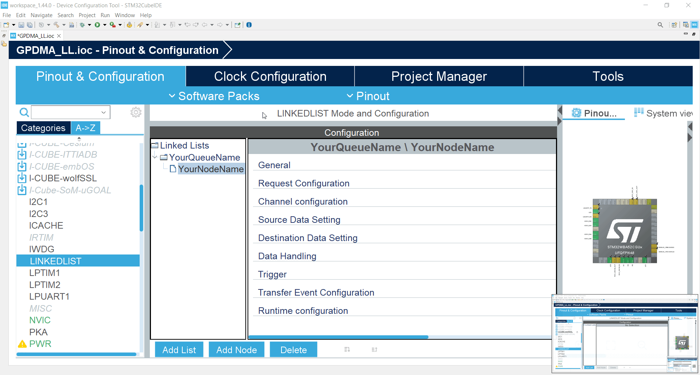

# Configue List/Queue 2/3

2. Set **Linear or circular LinkedList setting** to `Circular`

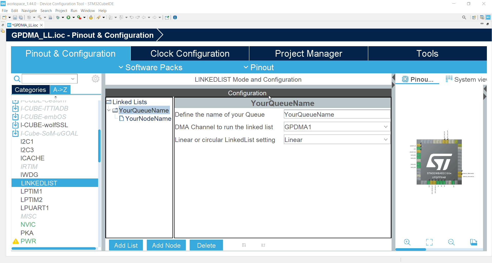

# Configue List/Queue 3/3

3. Set first node in loop, in our case put `YourNodeName`

```c
YourNodeName
```

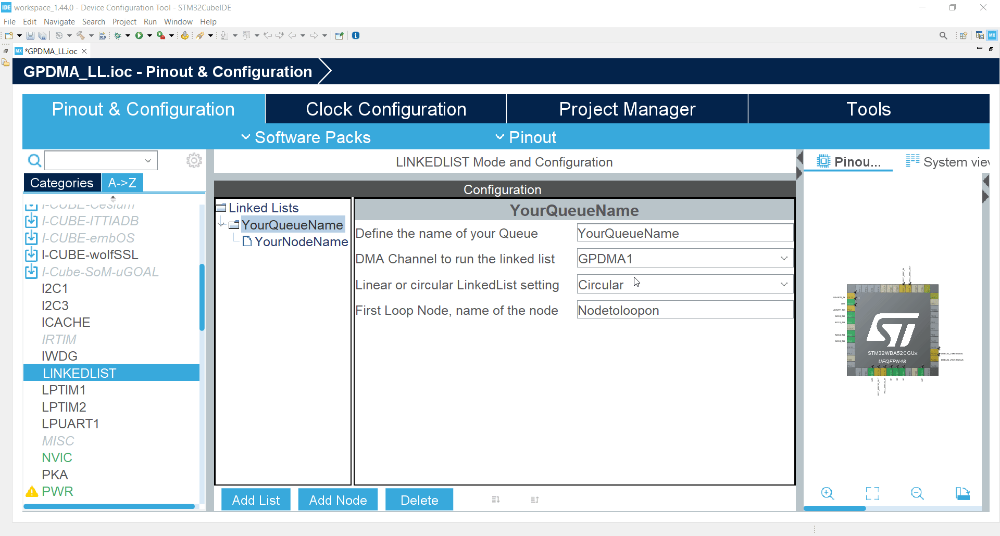

# Node loop

The first node in loop is where LLR from last node in queue will be pointed.
You can select any node in queue.
In our case when YourNodeName finishes he will reload same configuration. Because he is pointing on himself.


# Node configuration

1. Select Node


# Set node parameters 1/4

1. In **Request configuration ** set **Request as a parameter** to `ADC4`
   
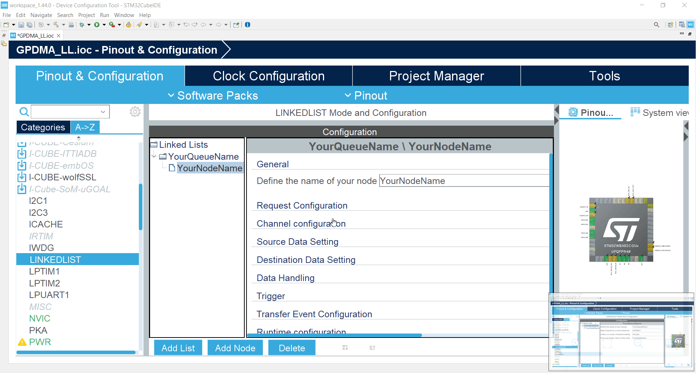

# Set node parameters 2/4

2. In **Source Data Setting** set **Data Width** to `Half Word`

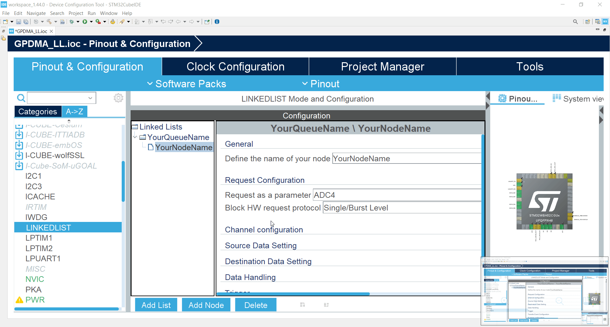

# Set node parameters 3/4

3. In **Destination Data Setting** set **Destination Address Increment After transfer** to `Enabled`

4. In **Destination Data Setting** set **Data Width** to `Half Word`

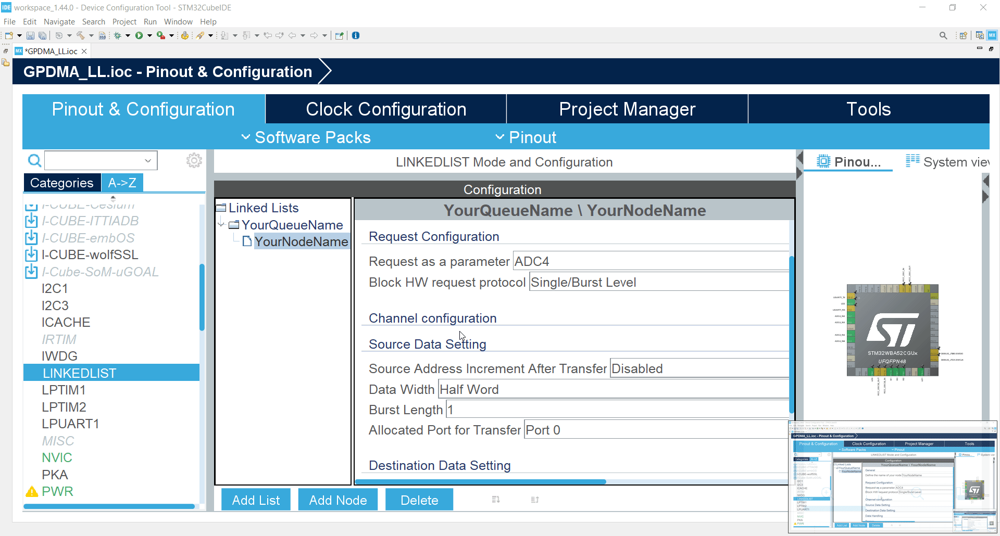

# Set node parameters 4/4

5. In **Runtime configuration** set **Source Address** to `ADC1->DR`

```c
(uint32_t)&(ADC4->DR)
```

6. In **Runtime configuration** set **Destination Address** to `data`

```c
(uint32_t)data
```

7. In **Runtime configuration** set **Data Size** to `SIZE`

```c
(64*2)
```

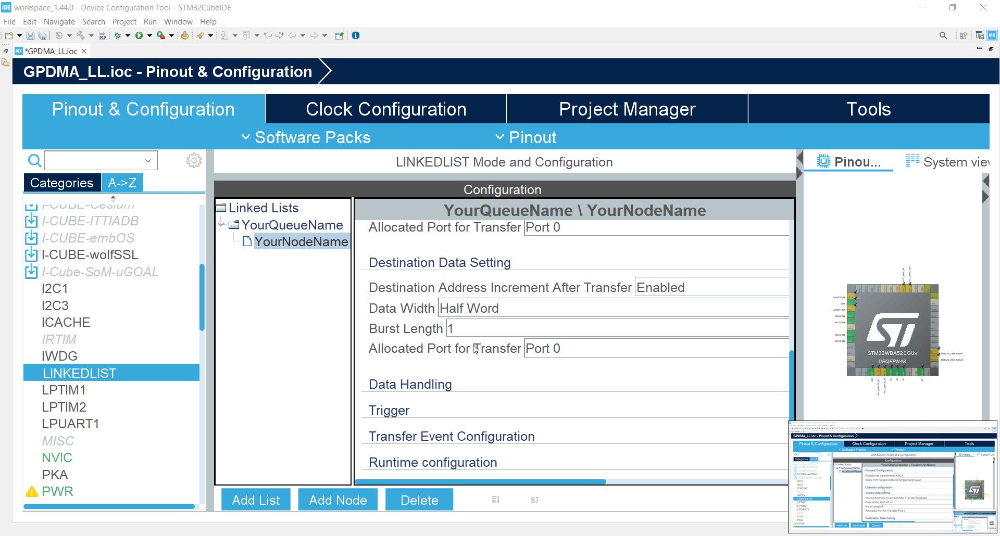

# Generate code

Now generate code

# Add linked_list.h include

First add **include** of `linked_list.h` into `main.c`

By adding 

```c
#include "linked_list.h"
```

To `USER CODE BEGIN Includes` section

```c-nc
/* USER CODE BEGIN Includes */
#include "linked_list.h"
/* USER CODE END Includes */
```

# Create buffer where to store ADC values

We create array `data` of 16bit elements with size 64 elements

Like this

```c
uint16_t data[64];
```

Put the array and size into `main.c` to section ` USER CODE BEGIN PV` like bellow

```c-nc
/* USER CODE BEGIN PV */
uint16_t data[64];
/* USER CODE END PV */
```

# Add Queue handle to main

Add `YourQueueName` extern variable to our `main.c`

By adding 

```c
extern DMA_QListTypeDef YourQueueName;
```

like 

```c-nc
/* USER CODE BEGIN PV */
uint16_t data[64];

extern DMA_QListTypeDef YourQueueName;
/* USER CODE END PV */
```

# Add size and data also to Queue config

Add 

```c
extern uint16_t data[];
```

to `linked_list.c` section `/* USER CODE BEGIN PM */` like

```c-nc
/* USER CODE BEGIN PM */
extern uint16_t data[];
/* USER CODE END PM */
```

# Call queue config

Use `MX_YourQueueName_Config` to initialize our nodes and queue.

Add

```c
  MX_YourQueueName_Config();
```

to `/* USER CODE BEGIN 2 */` section in `main.c` like


```c-nc
  /* USER CODE BEGIN 2 */
  MX_YourQueueName_Config();
  /* USER CODE END 2 */
```