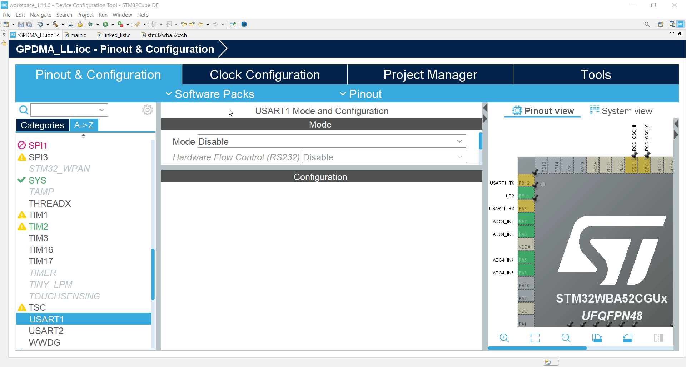
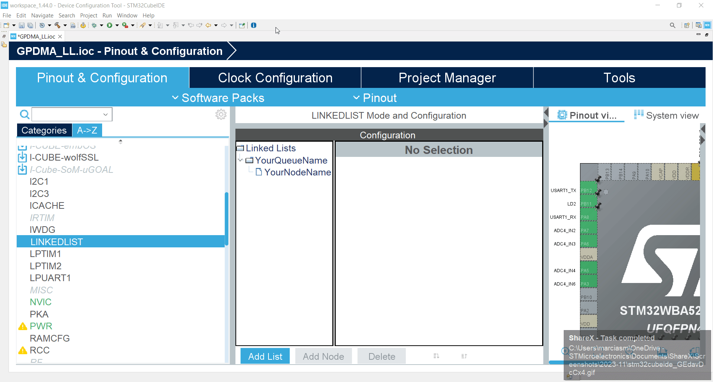
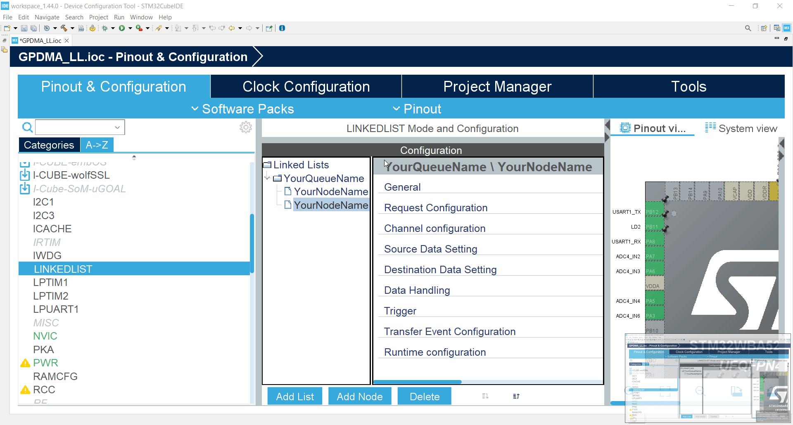
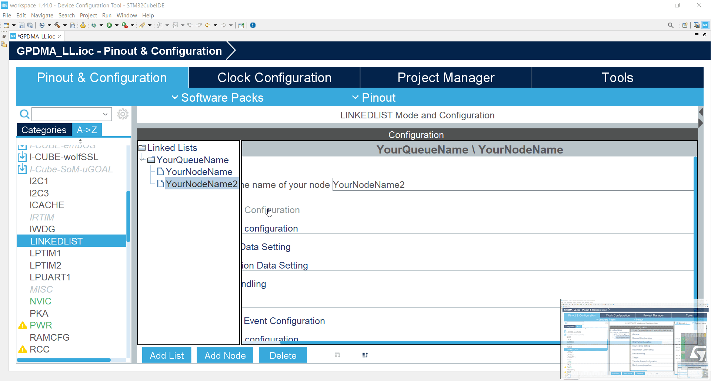
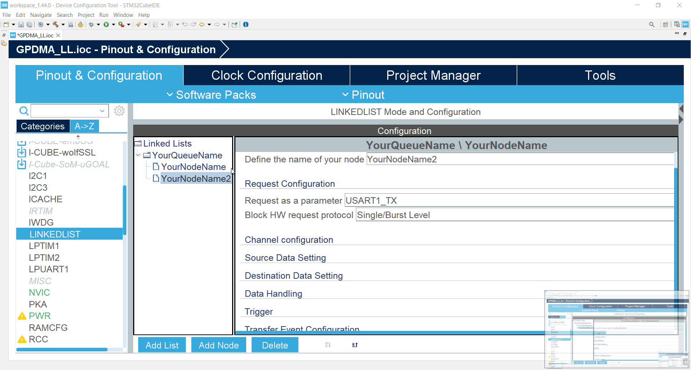
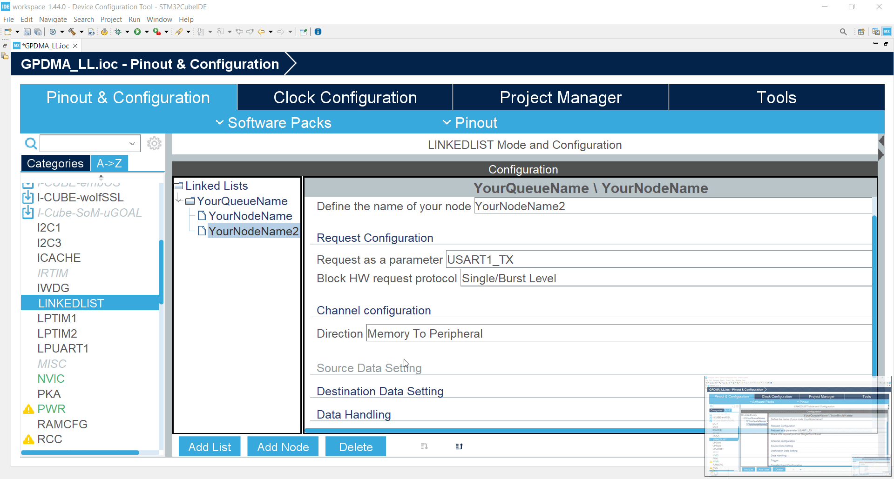
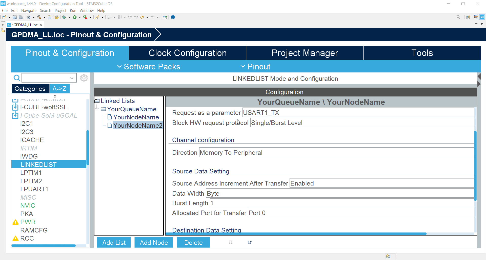

----!
Presentation
----!

# Selecting UART1

1. Open *.ioc file*
2. Select `USART1`
3. Set **Mode** as `Asynchronous`

4. Check that pins are at **PB12** & **PA8**



5. Keep default **baudrate** `115200`

# Select LINKEDLIST

1. Go to **LINKEDLIST** periphery again


# Add new node

1. Select Queue **YourQueueName**
2. **Add Node**



# Configure our new node 1/5

1. Set new name `YourNodeName2`

```c
YourNodeName2
```



# Configure our new node 2/5

2. In **Request configuration** set **Request as a parameter** to `USART1_TX`



# Configure our new node 3/5

3. In **Channel configuration** set **Direction** to `Memory to Periphery`



# Configure our new node 4/5

4. In **Source Data Sertting** set **Source Address Increment After Transfer** to `ENABLE` 



# Configure our new node 5/5

5. In **Runtime configuration** set **Source Address** to `data`

```c
(uint32_t)data
```

6. In **Runtime configuration** set **Destination address** to `&(UART1->TDR)`

```c
(uint32_t)&(USART1->TDR)
```

7. In **Runtime configuration** set **Data Size** to `(64*2)`

```c
(64*2)
```



# Generate code

Now we can **Generate code** and switch to `main.c`

# Start UART 1/2

## 1. First enable DMA request on USART1

By using  `ATOMIC_SET_BIT` into `main.c`

Use 

```c
    ATOMIC_SET_BIT(huart1.Instance->CR3, USART_CR3_DMAT);
```

like 


```c-nc
  /* USER CODE BEGIN 2 */
  MX_YourQueueName_Config();

  HAL_DMAEx_List_LinkQ(&handle_GPDMA1_Channel0, &YourQueueName);
  
  ATOMIC_SET_BIT(huart1.Instance->CR3, USART_CR3_DMAT);

  HAL_DMAEx_List_Start(&handle_GPDMA1_Channel0);
  ADC1->CFGR |= ADC_CFGR_DMAEN;
  HAL_ADC_Start(&hadc1);
  /* USER CODE END 2 */
```

# Start UART 2/2

## 2. Start UART for TX

We use `__HAL_UART_ENABLE` to start USART1

Put code

```c
    __HAL_UART_ENABLE(&huart1);
```

like 

```c-nc
  /* USER CODE BEGIN 2 */
  MX_YourQueueName_Config();

  HAL_DMAEx_List_LinkQ(&handle_GPDMA1_Channel0, &YourQueueName);
  
  ATOMIC_SET_BIT(huart1.Instance->CR3, USART_CR3_DMAT);
  __HAL_UART_ENABLE(&huart3);

  HAL_DMAEx_List_Start(&handle_GPDMA1_Channel0);
  ADC1->CFGR |= ADC_CFGR_DMAEN;
  HAL_ADC_Start(&hadc1);
  /* USER CODE END 2 */
```

# What we have

We added uart and use GPDMA to aquire data from ADC and send them over UART


