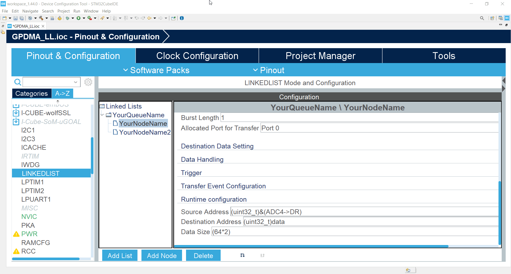
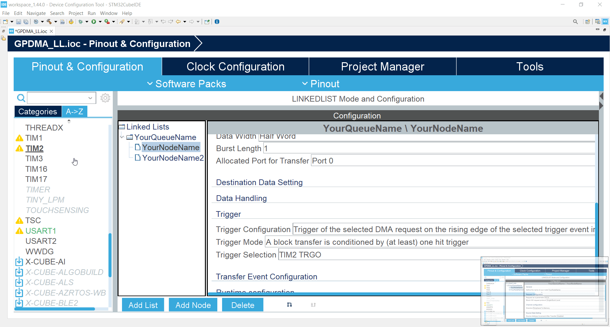

----!
Presentation
----!

# Select LINKEDLIST

1. Select `LINKEDLIST`
2. Select first node `YourNodeName`



# Select Trigger

   1. In **Trigger** section for option **Trigger configuration** set `Trigger of selected DMA request on rising edge of the selected trigger input event`
   2. In **Trigger** section for option **Trigger Selection** set `TIM2 TRGO`


# Select  TIM2 & Configure mode 

1. Select `TIM2`
2. Check `Internal Clock`



# TIM2 Configuration

1. Set **Prescaller** to `3999` (real value is 3999 + 1)
2. set **Counter Period** to `3999` (real value is 3999 + 1) to get trigger each 1s for 16MHz AHB
3. In **Trigger Outpput (TRGO) Parameters** section for option **Trigger Event Selection** set `Update event`


# Generate code 

**Generate code** and switch to `main.c`

# Start TIM15

Start TIM15 with `HAL_TIM_Base_Start`

Add 

```c
 HAL_TIM_Base_Start(&htim2);
```

at the end of `/* USER CODE BEGIN 2 */` section

```c-nc
  /* USER CODE BEGIN 2 */
  MX_YourQueueName_Config();

  HAL_DMAEx_List_LinkQ(&handle_GPDMA1_Channel0, &YourQueueName);
  
  ATOMIC_SET_BIT(huart1.Instance->CR3, USART_CR3_DMAT);
  __HAL_UART_ENABLE(&huart1);

  HAL_DMAEx_List_Start(&handle_GPDMA1_Channel0);
  ADC1->CFGR1 |= ADC_CFGR1_DMAEN;

  HAL_ADC_Start(&hadc1);

  HAL_TIM_Base_Start(&htim2);
  /* USER CODE END 2 */
```

# Compile and run code

1. Compile project
2. Run project in debugger

##You can see result in terminal application


# What we have

we start GPDMA by TIM event. Then GPDMA transfer data from ADC and sent them over UART


