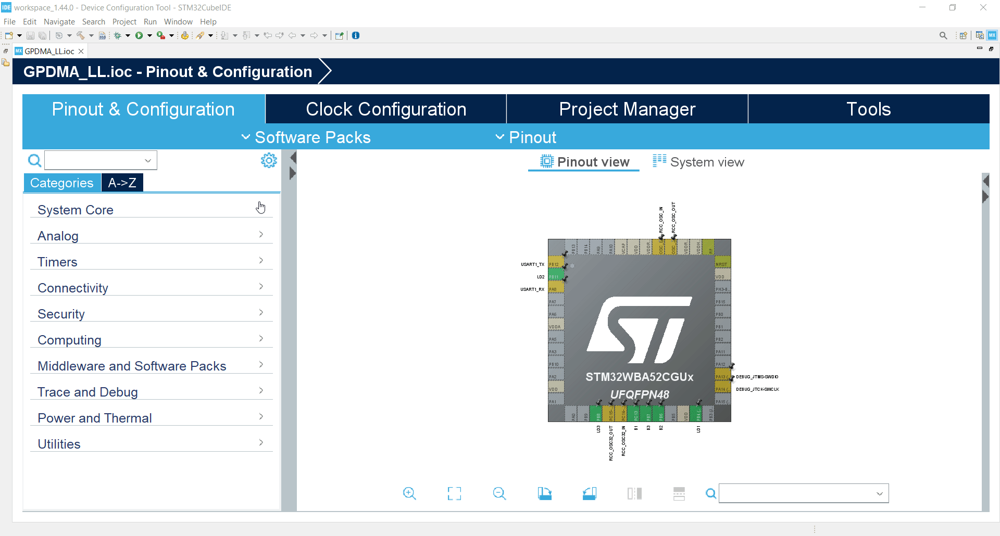
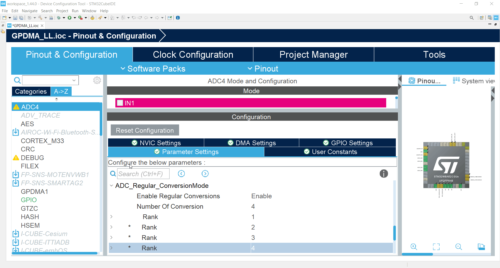
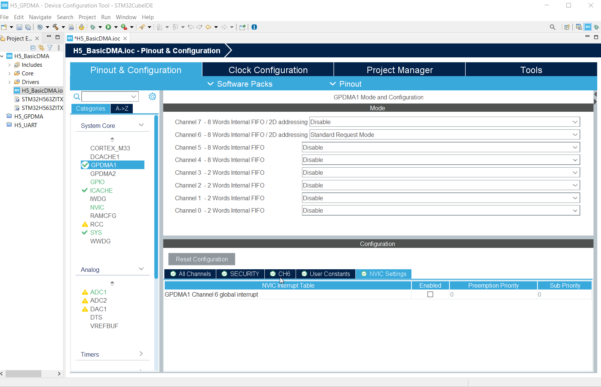

----!
Presentation
----!

# Select ADC4 periphery

Select `ADC4` in **Analog**



# Enable 4 adc channels
Enable channels IN**2**, IN**3**, IN**4**, IN**6** in Sigle-ended mode


# Configure the ADC 1/3

1. Set `Continuous conversion mode` to **Enable**

This option run ADC in loops. When ADC finish converting all its channels it will start again from beginning.

2. Set `Continuous conversion mode` to **Enable**

This option enable DMA request permanently.

3. Set `Low power wait` to **Enable**

This option will stop ADC until the DATA are read from it. It is good to prevent overrun. And we are sure that we have still correct order of channels.

4. Set `Enable Regular Conversions` to **Enable**


# Configure the ADC 2/3

1. Set `number of conversion` to **4**

This will set ADC to do 4 ADC conversions which we can set.


# Configure the ADC 3/3

1. You can set ADC channel for each `Rank`

Each rank will have assigned one ADC channel to convert. It is possible to select same channel each time.



# Select GPDMA1

1. Sececd `Go to GPDMA1` in **DMA Settings tab**
2. Enable channel with 2D addressing (6 or 7) in `Standard Request Mode`


# Configure GPDMA1 CH6 1/2

1. Select CH6
2. Set `Circular Mode` to **Enable**
3. Set `Request` to **ADC4**



# Configure GPDMA1 CH6 2/2

1. Set `Source Data Settings` - `Data Width` to **Half Word**
2. Set `Destination Data Settings` - `Destination Address Increment After Transfer` to **Enable**
3. Set `Destination Data Settings` - `Data Width` to **Half Word**


# Generate code

Click on **Generate Code** and switch to `main.c`

# Create buffer where to store ADC values

We create array `data` of 16bit elements wuth size as `SIZE`which is 64 elements

Like this

```c
uint16_t data[64];
```

Put the array and size into `main.c` to section ` USER CODE BEGIN PV` like bellow

```c-nc
/* USER CODE BEGIN PV */
uint16_t data[64];
/* USER CODE END PV */
```

# Start ADC and DMA

To start ADC+DMA we can use HAL function `HAL_ADC_Start_DMA`
We use it like this:

```c
  HAL_ADC_Start_DMA(&hadc4, data, 64);
```

we put it into section `USER CODE BEGIN 2` like bellow

```c-nc
  /* USER CODE BEGIN 2 */
  HAL_ADC_Start_DMA(&hadc4, data, 64);
  /* USER CODE END 2 */
```

`&hadc1` - is ADC handle which contains information about ADC1 and related DMA channel

`data` - buffer where to store data from ADC
`SIZE` - `data` buffer size 

# Compile code and run debug

1. Run debug

2. Opena **data** in `Live expresion` window

3. Run application by pressing `F8` or press Run 


# What we created

We have application of ADC with simple DMA transfer
<br>


